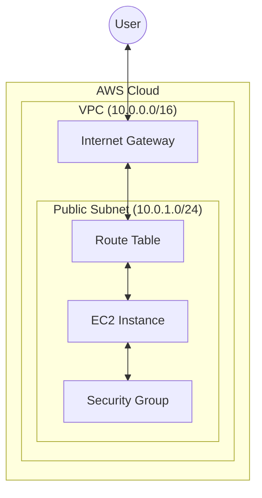
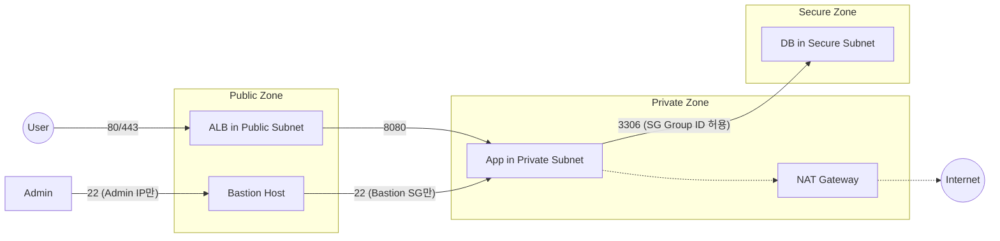

# AWS 네트워크 핵심 개념 이해

VPC와 그 구성 요소들은 마치 **'가상의 도시'**를 건설하는 것과 비슷합니다. 각 요소가 어떤 역할을 하는지 이해하면 CLI 명령어가 훨씬 쉬워집니다.

---

## 1. 주요 구성 요소 설명

| 요소 | 비유 | 설명 |
|:---:|:---:|:---|
| **VPC** | **도시 전체** | 나만의 독립된 가상 네트워크 공간입니다. 다른 사용자와 완전히 격리됩니다. |
| **Subnet** | **구역(동)** | VPC라는 도시를 여러 구역으로 나눈 것입니다. (예: 주거지역, 상업지역) |
| **Internet Gateway (IGW)** | **도시 관문** | VPC 내부의 자원들이 외부 인터넷과 통신할 수 있게 해주는 통로입니다. |
| **Route Table** | **이정표/내비게이션** | 데이터 패킷이 어디로 가야 할지 알려주는 규칙 모음입니다. |
| **Security Group** | **건물 보안 요원** | 인스턴스(서버) 단위의 방화벽으로, 허용된 포트의 트래픽만 통과시킵니다. |

---

## 2. 네트워크 흐름도 (Architecture)

---

---

## 3. 퍼블릭 vs 프라이빗 서브넷

서브넷은 **'인터넷 게이트웨이(IGW)로 향하는 길(Route)이 있는가?'**에 따라 성격이 결정됩니다.

| 구분 | 퍼블릭 서브넷 (Public) | 프라이빗 서브넷 (Private) |
|:---:|:---|:---|
| **외부 통신** | 인터넷에서 직접 접근 가능 | 외부에서 직접 접근 불가 (격리) |
| **IP 할당** | 퍼블릭 IP / 탄력적 IP(EIP) 할당 가능 | 오직 프라이빗 IP만 사용 |
| **주요 용도** | 웹 서버(ALB), Bastion Host 등 외부 노출용 | WAS(API), DB 등 데이터 보호가 중요한 서버 |
| **인터넷 연결** | IGW를 통해 직접 통신 | **NAT Gateway**를 통해 한 방향(내부->외부)만 가능 |

---

## 4. 보안을 위한 구역 분리 (Internal vs External)

실무에서는 보안을 위해 서비스를 최소 **3-Tier(Web-App-DB)**로 나누어 배치합니다.

### 4.1 구역별 보안 설계
1.  **외부망 (Public Zone)**: 인터넷 사용자가 접속하는 구간입니다. (예: 로드밸런서)
2.  **내부망 (Private Zone)**: 실제 비즈니스 로직이 수행되는 구간입니다. 
3.  **DB망 (Secure Zone)**: 데이터가 저장되는 가장 깊은 구간입니다.

### 4.2 서비스 간 내부 접근 시 고려 요소

1.  **최소 권한의 보안 그룹 (Security Group) -**
    *   **설정 방식**: 보안 그룹의 Inbound Rule을 설정할 때, Source(원본) 항목에 IP 대역(`10.0.1.0/24`) 대신 **상대방의 보안 그룹 ID(`sg-xxxx`)**를 입력합니다.
    *   **효과**: 서버의 IP가 바뀌거나 오토스케일링으로 서버 대수가 늘어나도, 동일한 보안 그룹만 달고 있다면 별도 설정 없이 즉시 통신이 허용됩니다. (관리가 매우 유연해집니다.)

2.  **NAT Gateway의 역할 -**
    *   **설정 방식**: 프라이빗 서브넷에 연결된 **라우팅 테이블(Route Table)**을 수정합니다.
    *   **규칙 추가**: `Destination: 0.0.0.0/0` (인터넷으로 가는 모든 길)의 `Target`을 `nat-xxxx`(미리 생성한 NAT 게이트웨이 ID)로 지정합니다.
    *   **결과**: 이제 프라이빗 서버에서 `yum update`나 외부 API 호출을 시도하면, 패킷이 자동으로 NAT 게이트웨이를 타고 외부로 나갑니다.

3.  **Bastion Host (교두보 서버) -**
    *   **접속 방식 (SSH Tunneling)**: 내 컴퓨터에서 바로 프라이빗 서버로 갈 수 없으므로, **ProxyJump** 방식을 사용합니다.
    *   **명령어 예시**: `ssh -i "key.pem" -J ec2-user@Bastion-IP ec2-user@Private-Server-IP`
    *   **보안 설정**: Bastion 서버의 보안 그룹에는 **오직 관리자의 사무실 IP**만 22번 포트로 허용되도록 설정합니다.

---

## 5. 실무 아키텍처 상세 가이드

사용자께서 언급하신 세 가지 주요 패턴에 대한 실무 설계 포인트를 정리합니다.

### 5.1 패턴 A: Frontend -> ALB -> Backend (표준 설계)
가장 권장되는 구조로, 보안과 확장성이 뛰어납니다.

*   **SSL Termination**: 사용자와 ALB 사이는 HTTPS(443)로 통신하고, ALB와 백엔드 사이는 HTTP(80)로 통신하여 서버의 암호화 부하를 줄입니다.
*   **보안 그룹 설계 (핵심)**: 백엔드 서버는 `0.0.0.0/0`을 열지 않고, **"오직 ALB의 보안 그룹으로부터 오는 요청만 허용"**하도록 설정합니다.
*   **Health Check**: ALB가 주기적으로 서버 상태를 확인하여 장애가 발생한 서버로는 트래픽을 보내지 않습니다.

### 5.2 패턴 B: Frontend (Nginx Proxy) -> Backend
Nginx를 직접 프록시 서버로 사용하는 경우입니다.

*   **Internal 통신**: Nginx에서 백엔드 서버를 바라볼 때 퍼블릭 IP가 아닌 **프라이빗 IP** 또는 **VPC 내부 DNS**를 사용해야 데이터 전송료를 아낄 수 있습니다.
*   **Header 전달**: `proxy_set_header X-Forwarded-For $proxy_add_x_forwarded_for;` 설정을 통해 사용자의 실제 IP를 백엔드에 전달해야 로그 분석이 가능합니다.
*   **Keep-alive**: Nginx와 백엔드 간의 TCP 연결을 유지하도록 설정하여 통신 지연(Latency)을 최소화합니다.

### 5.3 패턴 C: Backend -> 외부 API (via NAT Gateway)
프라이빗 서브넷의 서버가 외부 API(결제, 공공데이터 등)를 호출할 때입니다.

*   **EIP 화이트리스팅**: 외부 API 업체에서 보안을 위해 접속 IP를 요구하면, 서버 IP가 아닌 **NAT Gateway의 탄력적 IP(EIP)**를 알려주어야 합니다.
*   **고가용성 (HA)**: NAT Gateway는 가용 영역(AZ)별로 이중화하는 것이 원칙입니다. 한쪽 NAT GW에 장애가 나도 서비스가 중단되지 않게 하기 위함입니다.
---

### 5.4 패턴 D: VPC Endpoint (AWS 서비스와 통신)
NAT Gateway를 거치지 않고 S3, RDS, Secrets Manager 등 AWS 서비스와 **내부망으로 직접** 통신할 때 사용합니다.

*   **보안 강화**: 데이터가 인터넷 구간을 전혀 타지 않고 AWS 내부망 안에서만 이동합니다.
*   **비용 절감**: NAT Gateway의 데이터 처리 비용(GB당 과금)을 획기적으로 줄일 수 있어 실무에서 **비용 최적화 1순위**로 검토됩니다.
*   **종류**: S3/DynamoDB용 **Gateway형**과 그 외 서비스용 **Interface형**이 있습니다.

### 5.5 패턴 E: Internal Load Balancer (서비스 간 통신)
사용자에게 노출되지 않는 '내부용' 로드밸런서입니다. MSA 구조에서 서비스 A가 서비스 B를 호출할 때 사용합니다.

*   **DNS 기반 호출**: 서비스 B의 IP가 바뀌어도 Internal ALB의 DNS 주소는 고정되므로 안정적인 통신이 가능합니다.
*   **보안 격리**: 프라이빗 서브넷 안에만 존재하므로, 외부에서는 존재조차 알 수 없습니다.

### 5.6 패턴 F: VPN / Direct Connect (하이브리드 클라우드)
회사의 사무실(On-premise)과 AWS VPC를 하나의 네트워크처럼 연결할 때 사용합니다.

*   **사내망 연동**: 개발자가 회사 컴퓨터에서 AWS의 프라이빗 서버에 마치 옆자리 컴퓨터처럼 접속(SSH 등)할 수 있게 해줍니다.
*   **보안 채널**: 공용 인터넷망을 사용하되 데이터를 암호화(VPN)하거나, 아예 전용선(Direct Connect)을 깔아 속도와 보안을 극대화합니다.

---

